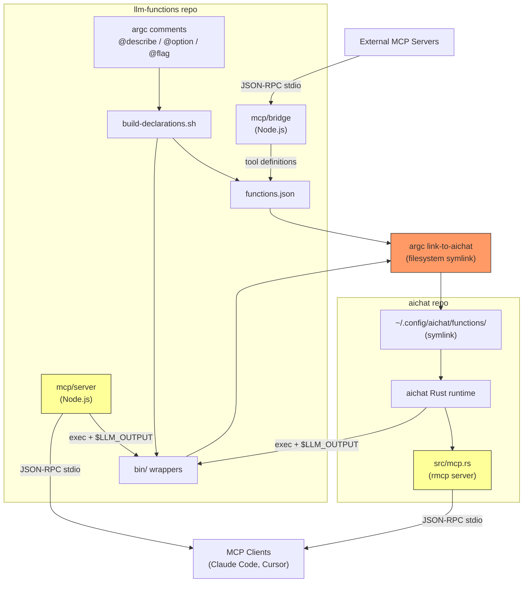
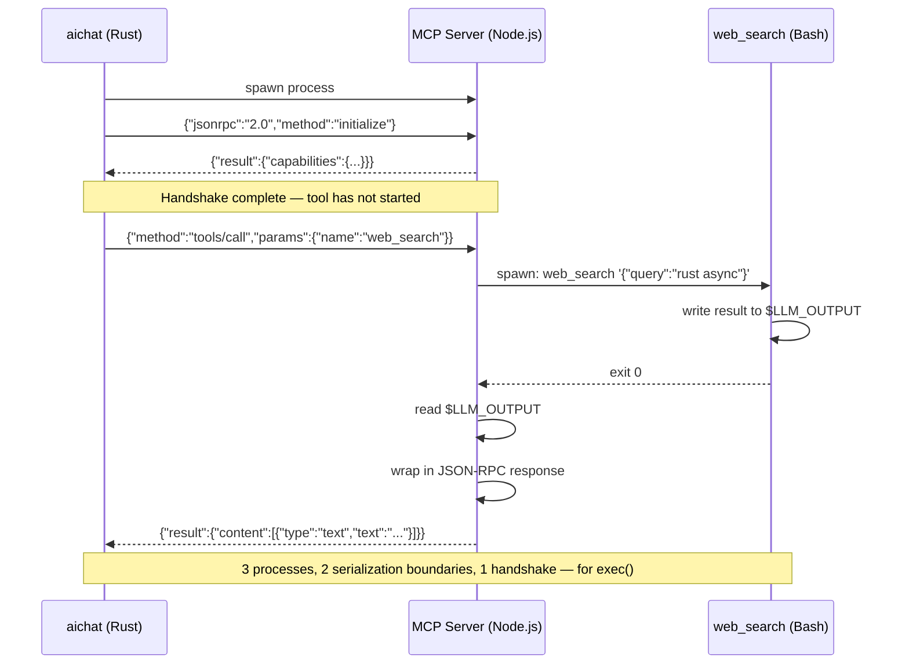
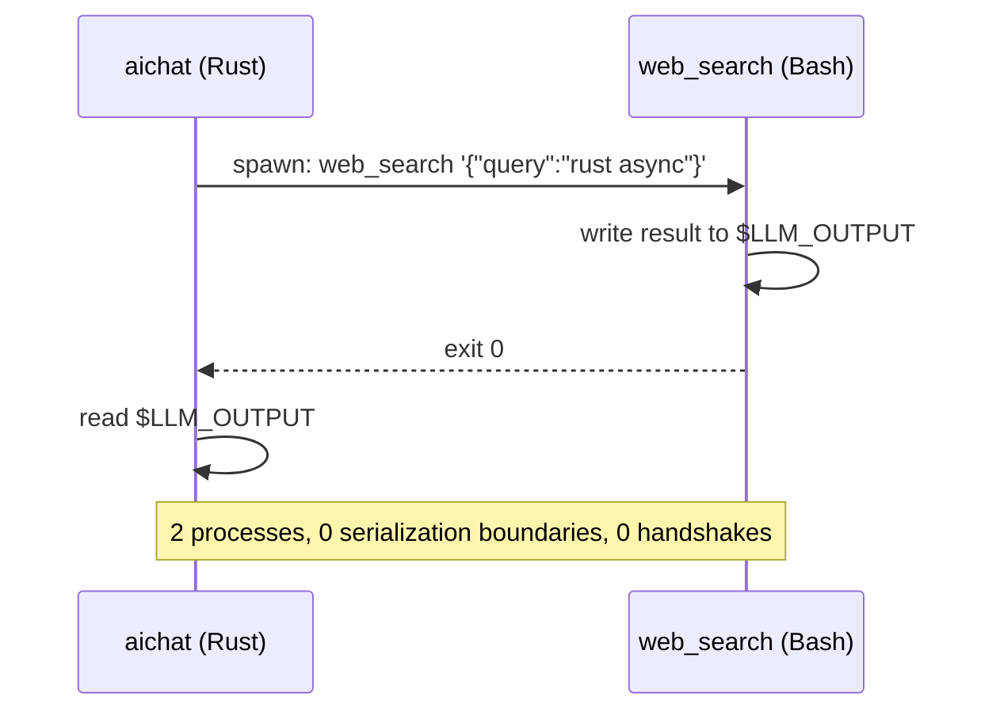
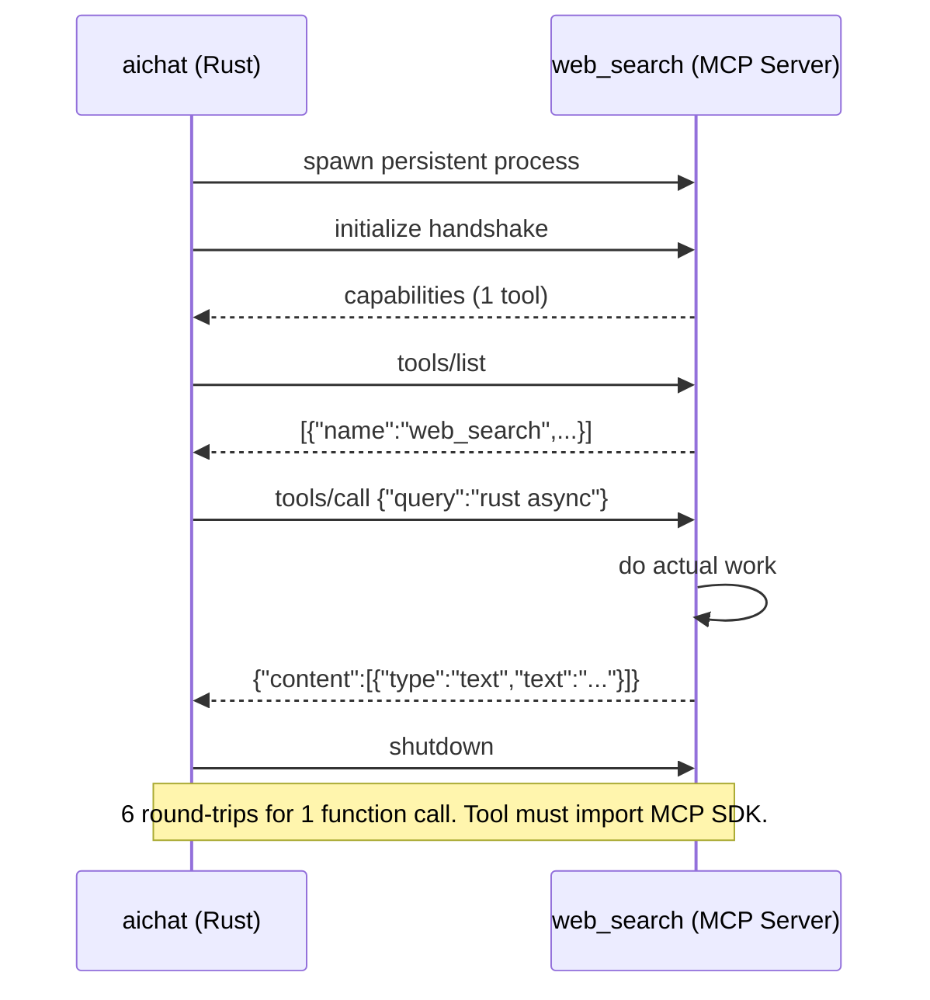
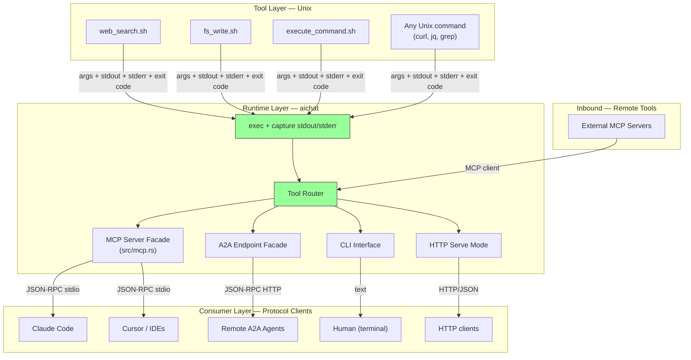
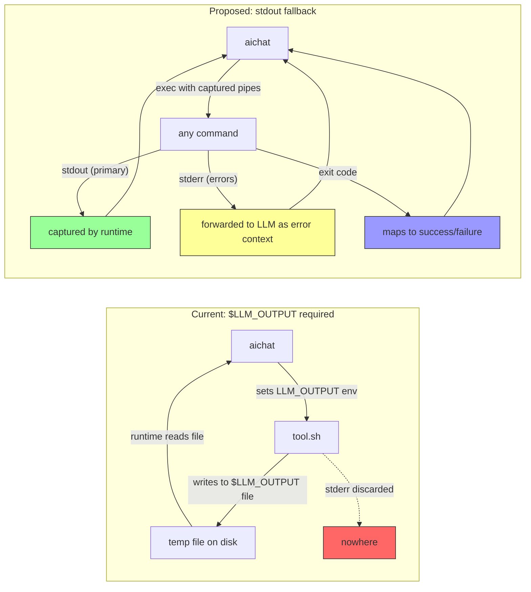
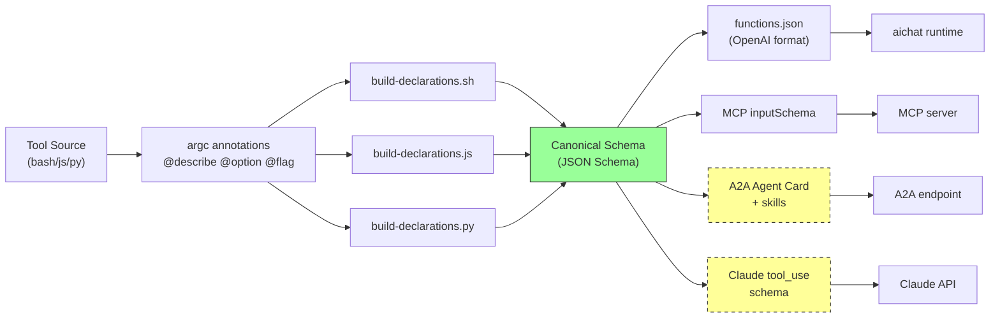
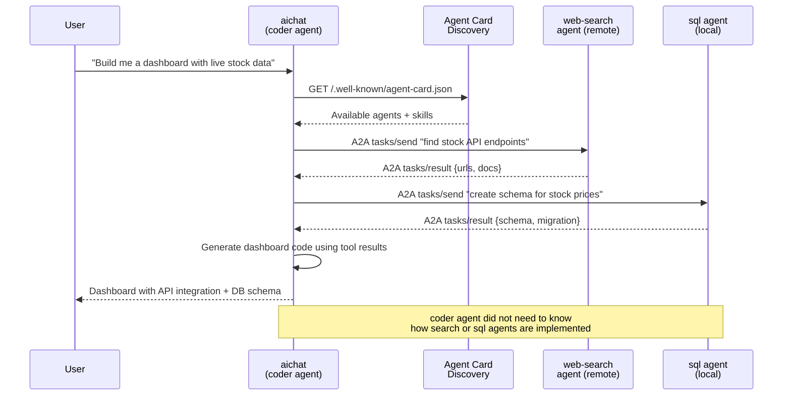
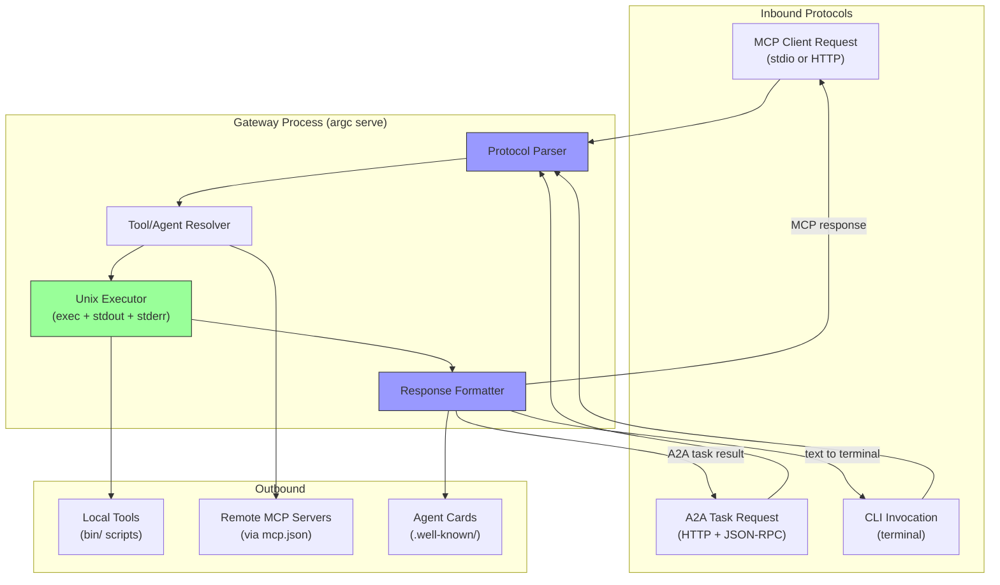

# Evaluation: aichat + llm-functions Integration

**Date:** 2026-03-10

## Current Architecture

```
llm-functions (tool definitions)
    |
    +-- argc comments -> build-declarations -> functions.json
    +-- bin/ wrappers (shell scripts)
    |
    +-- mcp/server (Node.js) -> exposes tools via MCP stdio
    +-- mcp/bridge (Node.js) -> imports external MCP tools into llm-functions
         |
aichat (Rust runtime)
    |
    +-- reads functions.json + calls bin/ executables
    +-- src/mcp.rs -> re-exposes those same tools as MCP server (Rust/rmcp)
    +-- $LLM_OUTPUT file protocol for tool results
```

## Friction Points

1. **Dual MCP servers, divergent behavior.** Both `mcp/server/index.js` (in llm-functions) and `src/mcp.rs` (in aichat) expose the same tools as MCP servers. They are maintained separately, can drift, and a consumer does not know which to use.

2. **Symlink-based coupling.** `argc link-to-aichat` creates a symlink to wire llm-functions into aichat's config dir. This is fragile -- it breaks across machines, does not version, and makes the two repos feel like one monolith split awkwardly in two.

3. **Custom IPC protocol.** The `$LLM_OUTPUT` temp-file convention is bespoke. Every tool must know to write there. This works, but it is invisible to any protocol-aware client (MCP, A2A) without a wrapper.

4. **No discovery mechanism.** Tools are only discoverable by reading `functions.json` from disk. There is no runtime discovery, no capability advertisement, and no way for an external agent to find what is available without filesystem access.

5. **MCP bridge is one-directional.** The bridge imports external MCP tools *into* llm-functions, but there is no standard way for llm-functions agents to *advertise themselves* to other agent systems.

## Why NOT to Wrap Tools in MCP

Before proposing changes, it is worth confronting the strongest argument against the most obvious "modernization" — making MCP the internal protocol between aichat and its tools.

### What "unify on MCP" actually looks like at the process level

Tracing the actual bytes and processes for each approach:

**Scenario A: MCP as internal protocol (shared server)**

```
aichat (Rust)
    |
    spawns: node mcp/server/index.js /path/to/llm-functions
    |
    writes to child stdin:  {"jsonrpc":"2.0","method":"initialize",...}
    reads from child stdout: {"jsonrpc":"2.0","result":{"capabilities":...}}
    writes to child stdin:  {"jsonrpc":"2.0","method":"tools/call",
                              "params":{"name":"web_search",...}}
    |
        Node.js MCP server receives JSON-RPC request
        spawns: web_search '{"query":"rust async"}'
        reads $LLM_OUTPUT from grandchild
        wraps result in JSON-RPC response
    |
    reads from child stdout: {"jsonrpc":"2.0","result":{"content":[...]}}
```

Three processes: Rust -> Node.js -> Bash. The Node.js middle layer exists solely to deserialize JSON-RPC, exec a shell command, read a file, and reserialize JSON-RPC. It is a proxy.

**Scenario B: Current approach (what actually happens today)**

```
aichat (Rust)
    |
    spawns: web_search '{"query":"rust async"}'
    reads $LLM_OUTPUT
```

Two processes. No intermediary. No handshake.

**Scenario C: Each tool is its own MCP server (the "pure" version)**

```
aichat (Rust)
    |
    spawns: web_search (now a persistent MCP server process)
    |
    JSON-RPC initialize handshake
    JSON-RPC tools/list (returns 1 tool)
    JSON-RPC tools/call
    JSON-RPC shutdown
```

Capability negotiation for a tool that has one capability. It needs to stay running as a server to handle a single call. Every tool author now needs to import an MCP SDK instead of writing `echo "$result" >> "$LLM_OUTPUT"`.

### The verdict

In all three scenarios, the actual work is **exec()**. MCP does not replace exec — it wraps it in JSON-RPC framing between two processes on the same machine talking through a pipe. The pipe is already there (stdin/stdout). MCP adds a serialization layer on top that requires both sides to agree on a protocol, maintain connection state, and handle errors at the RPC level in addition to the process level.

The only thing MCP adds locally is a structured envelope around data that is already structured (JSON args in, JSON result out). It is `exec` with extra steps.

### The case against MCP as tool IPC

**MCP stdio transport hijacks stdin/stdout for JSON-RPC framing.** Once a process speaks MCP, its stdout is no longer a stream of text — it is a stream of `{"jsonrpc":"2.0",...}` messages. You cannot pipe it to `grep`. You cannot `| jq`. You cannot `2>&1`. The tool is no longer composable with anything that is not an MCP client.

The `$LLM_OUTPUT` temp-file convention looks bespoke, but it is actually *more* Unix than MCP. It is equivalent to `> $LLM_OUTPUT` — a file descriptor redirect. The tool still writes plain text or JSON to a file. You could replace it with stdout and nothing would break conceptually. MCP replaces that with a bidirectional RPC session that requires a handshake, capability negotiation, and an SDK.

Specific objections:

1. **It inverts the dependency.** Today a tool is a script that takes args and produces output. Any shell can call it. Making MCP primary means every tool needs an MCP-aware caller or wrapper — that is a runtime dependency on a specific protocol just to call a function.

2. **It breaks composition.** `web_search "rust async" | jq '.results[0].url' | fetch_url` is impossible if `web_search` speaks MCP. You would need an MCP client to unwrap the JSON-RPC response before piping it anywhere.

3. **It adds mandatory complexity for tool authors.** Right now writing a tool is: write a bash script with argc comments, output to `$LLM_OUTPUT`. That is a 10-line file. An MCP server requires importing an SDK, registering handlers, managing transport lifecycle.

4. **It conflates transport with interface.** The *tool's job* is to do one thing and return a result. The *protocol's job* is to make that result available to different consumers. Fusing them means every tool must know about every consumer.

5. **The existing protocol already works.** exec + args + env + file output is the Unix IPC protocol. It has been working for 50 years. The `$LLM_OUTPUT` convention is the only non-standard part, and it could be eliminated by just reading stdout instead.

### Where MCP belongs

MCP has clear value as an **outward-facing facade** — it is how external clients (Claude Code, Cursor, other agents) discover and invoke your tools without filesystem access. This is already what `src/mcp.rs` does: it calls `ToolCall::eval()` (which execs the binary) and wraps the result in MCP `Content::text()`. That is the correct pattern.

MCP also has value for **consuming remote tools** — the `mcp/bridge` correctly uses MCP as a client to import tools from external MCP servers.

The mistake would be pushing MCP *down* into the local tool invocation path, adding a protocol layer between processes that are already communicating through the most efficient IPC mechanism available: exec + pipes.

### The correct layering

Tools should not speak MCP. The runtime should.

```
Tools (exec + stdout + exit code)     <-- Unix layer, tool authors live here
    |
aichat / llm-functions runtime        <-- translation layer
    |
    +-- MCP server (for Claude Code, Cursor, etc.)
    +-- A2A endpoint (for agent discovery)
    +-- CLI (for humans)
```

aichat is the **bridge** between the Unix world and the protocol world. Tools stay dumb and composable. The protocol facades live in the runtime, not in the tools.

### What to fix instead

The real friction is not the tool protocol — it is the plumbing around it:

- **`$LLM_OUTPUT` should become optional.** If a tool writes to stdout and `$LLM_OUTPUT` is not set, the runtime should capture stdout. If `$LLM_OUTPUT` is set, use it. This makes tools work as normal Unix commands *and* as aichat functions without modification.
- **stderr should be captured and forwarded.** Today stderr is silently discarded or printed to the terminal. The runtime should capture it and include it in error responses to the LLM.
- **Exit codes should map to tool error states.** Non-zero exit already causes a bail, but the error message could carry the stderr content for better LLM debugging.

With those three changes, any Unix command becomes a valid llm-functions tool with zero modification. The protocol layer (MCP, A2A) stays in the runtime where it belongs.

## Recommendations

### 1. Normalize tool I/O to Unix conventions

Make `$LLM_OUTPUT` optional. If unset, the runtime reads stdout. Capture stderr separately and forward it as error context. Map exit codes to success/failure. This means `curl`, `jq`, `grep` — any command — is a valid tool without a wrapper script.

### 2. Add A2A Agent Cards for agent discovery

Each llm-functions agent (`agents/coder/`, `agents/todo/`, etc.) maps naturally to an A2A Agent Card. Generate these alongside `functions.json`:

```json
{
  "name": "coder",
  "description": "Code development assistant using filesystem tools",
  "url": "http://localhost:8808/agents/coder",
  "version": "0.1.0",
  "capabilities": {
    "streaming": false,
    "pushNotifications": false
  },
  "skills": [
    {
      "id": "fs_write",
      "name": "Write File",
      "description": "Write content to a file path",
      "inputModes": ["application/json"],
      "outputModes": ["text/plain"]
    }
  ]
}
```

**Concrete step:** Add an `argc build-agent-card` command that generates agent cards from `index.yaml` + `functions.json`. The existing comment-driven schema generation already has all the metadata needed.

### 3. Restructure the bridge as a bidirectional gateway

The current `mcp/bridge` imports external MCP tools. Extend it to also *export* llm-functions agents as A2A endpoints:

```
                    +---------------------------+
                    |   llm-functions gateway    |
                    |                            |
  MCP clients <----+  MCP server (stdio/http)   |
                    |                            |
  A2A clients <----+  A2A endpoint (http)       +---> Agent Cards
                    |                            |
  CLI users <------+  bin/ wrappers (exec)      |
                    |                            |
  External MCP --->+  MCP bridge (client)       |
                    +---------------------------+
```

This keeps the Unix ethos -- each tool is still a standalone script -- but adds protocol facades. The gateway is a single process (`argc serve`?) that speaks all three protocols.

### 4. Decouple tool metadata from aichat's config directory

Currently the coupling goes: llm-functions -> symlink -> `~/.config/aichat/functions/`. Instead:

- **llm-functions publishes a manifest** (enhanced `functions.json` with transport info, version, and tool categories)
- **aichat discovers tools by endpoint**, not by filesystem path. Config becomes:

```yaml
# config.yaml
tool_sources:
  - type: mcp
    endpoint: stdio
    command: ["npx", "mcp-llm-functions", "/path/to/llm-functions"]
  - type: mcp
    endpoint: "http://localhost:8808"
  - type: local
    path: "~/.config/aichat/functions"  # backward compat
```

This lets you run llm-functions on a different machine, in a container, or as a shared team service without changing aichat's tool code at all.

### 5. Standardize the tool schema as the single source of truth

The argc comment annotations (`@describe`, `@option`, `@flag`) already contain everything needed to generate:
- `functions.json` (OpenAI function calling format) -- **already done**
- MCP tool definitions (name + inputSchema) -- **already done**
- A2A skill definitions (id + inputModes + outputModes) -- **not yet**
- Claude tool_use schema -- **trivially derived**

Add output modes to the build pipeline:

```bash
argc build-declarations@tool --format openai    # current default
argc build-declarations@tool --format mcp       # MCP inputSchema
argc build-declarations@tool --format a2a       # Agent Card skills
argc build-declarations@tool --format all       # everything
```

Since these are all JSON Schema variants, the argc annotations are sufficient. No new annotation syntax needed.

### 6. Composable agent delegation via A2A tasks

The key feature of A2A over MCP is **task lifecycle** -- an agent can send a task to another agent, get progress updates, and receive final results. This maps to how llm-functions agents already work but adds cross-system orchestration:

```
User -> aichat (coder agent)
         |
         +-- needs to search the web -> delegates to web-search agent via A2A
         +-- needs to run SQL -> delegates to sql agent via A2A
         +-- composes results back to user
```

Today, agents can only use tools from their own `functions.json` plus shared tools. With A2A task delegation, an agent could discover and delegate to *any* agent on the network -- including ones not written with llm-functions at all.

**Concrete step:** Add an `agent_sources` config in aichat that discovers remote agents via Agent Card URLs, just like `mcp.json` discovers MCP servers today.

## Implementation Priority

| Priority | Change | Effort | Impact |
|----------|--------|--------|--------|
| **1** | Normalize tool I/O (optional `$LLM_OUTPUT`, capture stderr) | Low | Any Unix command becomes a valid tool |
| **2** | Agent Card generation from existing metadata | Low | Unlocks A2A discovery |
| **3** | `tool_sources` config with MCP endpoint support | Medium | Decouples the two repos cleanly |
| **4** | Bidirectional gateway (`argc serve`) | Medium | Single entry point for all protocols |
| **5** | A2A task delegation between agents | High | Cross-system agent composition |

## What to Preserve

- **exec + stdout + exit code as the tool contract** -- this is Unix IPC. Do not replace it with a protocol.
- **argc comment-driven schemas** -- this is genuinely elegant and should remain the authoring format
- **bin/ wrappers for CLI use** -- `aichat -e "what's the weather"` should keep working without a running server
- **Language-agnostic tools** -- bash/js/py support is a strength
- **The "one tool per job" Unix ethos** -- protocols are transport, not architecture. Each tool stays a single-purpose script
- **MCP and A2A as runtime facades** -- aichat translates between Unix tools and protocol consumers. Tools never need to know.

## Key Insight

Tools are Unix. Protocols are runtime. The tool contract is exec + args + stdout + stderr + exit code. MCP and A2A are facades that the runtime (aichat) projects outward to protocol-aware consumers. Pushing protocols down into tools breaks the composition that makes Unix tools useful in the first place. The `$LLM_OUTPUT` convention is the one deviation from pure Unix — making it optional is the highest-leverage change in this entire document.

---

## Diagrams

### Current Architecture

How aichat and llm-functions are wired together today.



### Scenario A: MCP as Internal Protocol (Rejected)

What happens at the process level if MCP is used between aichat and tools. Three processes for a single tool call.



### Scenario B: Current Approach (Direct exec)

What actually happens today. Two processes, no intermediary.



### Scenario C: Each Tool as MCP Server (Rejected)

The "pure MCP" option where every tool is a persistent server. Protocol overhead dominates a one-shot call.



### Recommended Architecture: Unix Core with Protocol Facades

Tools stay as plain executables. The runtime translates to protocols at the boundary.



### Tool I/O: Current vs Proposed

How normalizing `$LLM_OUTPUT` makes any command a valid tool.



### Schema Generation Pipeline

How argc annotations flow through to multiple output formats.



### A2A Agent Delegation

How agents discover and delegate to each other across system boundaries.



### Bidirectional Gateway

Single process that bridges all protocol boundaries.


