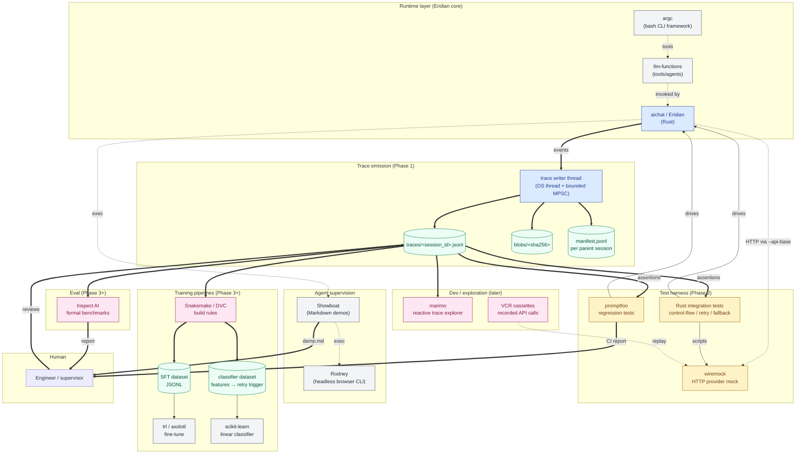

# Eridian Ecosystem — Future State

This document maps the future-state ecosystem around Eridian. It answers:
*if I succeed at building Eridian and its surrounding tooling, what does the picture
look like, and what role does each component play?*

The unifying thesis: **the structured trace is the central artifact.** Every
downstream consumer — testing, evaluation, training data extraction, observability —
reads the same trace format. This avoids lock-in to any one tool's data model and
keeps Eridian itself simple.

## Diagram

Legend: blue = Phase 1 work, yellow = Phase 2, pink = Phase 3+, gray = external
tools, green = data artifacts.

## Component roles

### Runtime layer

- **Eridian (aichat fork)** — the LLM CLI. Sole producer of structured traces.
  Wraps prompts, RAG retrieval, role application, provider calls, retries,
  fallback, and tool execution into a coherent runtime. Emits one JSONL trace per
  turn. Phase 1 work is concentrated here.
- **llm-functions** ([sigoden/llm-functions](https://github.com/sigoden/llm-functions))
  — the tools and agents library. Bash/JS/Python functions registered as callable
  tools. Eridian shells out to these when the model requests a tool call. Trace
  events `tool.requested` and `tool.executed` capture this boundary.
- **argc** ([sigoden/argc](https://github.com/sigoden/argc)) — the bash CLI
  framework that powers most llm-functions tools. Enables deterministic,
  structured CLI behavior from shell scripts. First-class citizen for both tool
  definition and as a fixture mechanism in the test harness.

### Trace emission

- **Writer thread** — a dedicated OS thread that owns the trace JSONL file
  handle and the blob store. Receives events over a bounded MPSC channel. See
  `ADR-0003` for design rationale.
- **`traces/<session_id>.jsonl`** — append-only event log, one event per line,
  flushed after each write. Streaming-safe.
- **`blobs/<sha256>`** — content-addressed payload store for large strings
  (prompts, RAG contexts, tool outputs). Referenced from events by hash.
- **`manifest.jsonl`** — per parent-session listing of child turn session IDs
  in order. Lets `tail -f manifest.jsonl` watch a whole conversation.

### Test harness

- **promptfoo** ([promptfoo/promptfoo](https://github.com/promptfoo/promptfoo))
  — declarative YAML regression tests. Targets Eridian as an `exec` provider.
  Fast iteration loop, matrix testing across roles × models × fixtures, GitHub
  Action for CI. The volume layer of tests live here.
- **wiremock** ([Rust crate](https://docs.rs/wiremock/)) — HTTP server that
  scripts provider behavior for tests. Lets us inject 502s, 429s, malformed
  bodies, slow responses, and stream interruptions deterministically. Eridian is
  pointed at it via `--api-base`.
- **Custom Rust integration tests** — small, high-value, exercise control-flow
  behavior (retry sequencing, fallback selection, tool denial enforcement) by
  asserting on the trace event stream. Live in `tests/control_flow/`.

### Agent supervision

- **Showboat** ([simonw/showboat](https://github.com/simonw/showboat)) — Go CLI
  that helps coding agents construct a Markdown document demonstrating their
  work. Each implementation milestone produces a `demos/<milestone>.md`
  artifact. See `CLAUDE.md` for the standard invocation pattern.
- **Rodney** ([simonw/rodney](https://github.com/simonw/rodney)) — Go CLI for
  headless Chrome automation, designed to compose with Showboat's `exec`
  command. Used when demos involve the `aichat --serve` playground or any web
  UI surface.

### Eval — deferred

- **Inspect AI** ([UKGovernmentBEIS/inspect_ai](https://github.com/UKGovernmentBEIS/inspect_ai))
  — formal LLM evaluation framework from UK AISI. Used when running curated
  benchmarks against Eridian as an external agent (e.g., "does the rust-reviewer
  role score higher on a bug-finding eval than a generic prompt?"). Distinct
  from regression testing; brought in only when there are real benchmarks to
  run.

### Training pipelines — deferred

- **Snakemake or DVC** — build system that consumes the trace directory and
  produces datasets via content-addressed rules. DVC's caching is especially
  valuable for memoizing expensive LLM calls.
- **trl / axolotl** — fine-tuning pipelines for SFT/DPO consuming the JSONL
  datasets the build rules produce.
- **scikit-learn** — for the small classifier model use case (e.g., predict
  retry-worthy provider failures from request features).

### Dev / exploration — deferred

- **marimo** ([marimo-team/marimo](https://github.com/marimo-team/marimo)) —
  reactive Python notebook for interactively exploring traces, prototyping new
  extraction rules, and debugging tricky test cases. The reactive model
  re-renders downstream cells when trace files change, which is genuinely
  useful for iteration.
- **VCR cassettes** — recorded real API calls replayed via wiremock for
  prompt-template regression tests. Phase 3 because it adds management overhead
  (cassette refresh, secret scrubbing) that Phase 2's scripted mocks don't.

## What is *not* in this picture

- **MCP servers.** Eridian deliberately avoids requiring MCP for tool use or
  testing. argc + llm-functions cover the local-tool case; wiremock covers the
  test case.
- **OpenTelemetry GenAI semantic conventions.** Considered and rejected as the
  source of truth — they don't capture retry attempts, fixture-injected
  failures, or role/whitelist application as first-class events. May be
  produced as a *projection* later if observability tooling demands it.
- **Cloud eval platforms (Langfuse, LangSmith, Braintrust).** These compete with
  the local-first principle and lock you into their data model. Skipped.

## Future-state walkthrough

A day in the life of an Eridian user, once everything below is built:

1. User runs `aichat --role rust-reviewer "review this code"`. Eridian produces a
   normal response. Behind the scenes, a JSONL trace lands in
   `~/.local/state/aichat/traces/`.
2. User opens marimo, points it at the traces directory, and gets a reactive
   view of recent sessions: prompts, retries, latency, costs.
3. User notices a regression — the rust-reviewer role started missing `unwrap`
   calls last week. They drop a few traces into `tests/regression/fixtures/`,
   write a promptfoo assertion, and CI now catches the regression on every PR.
4. User wants to verify retry behavior after refactoring a provider's HTTP
   client. They write a wiremock-driven Rust integration test asserting on the
   trace event sequence.
5. User accumulates 10k traces with thumbs-up feedback signals. A Snakemake
   rule materializes those into an SFT dataset; trl fine-tunes a small Qwen
   model that handles the rust-reviewer role for free locally.
6. When delivering a new feature, Claude Code runs Showboat to produce a
   `demo.md` proving the feature works; the user reviews the Markdown rather
   than the code.

That's the destination. Phase 1 is the trace emission that makes all of it
possible.
